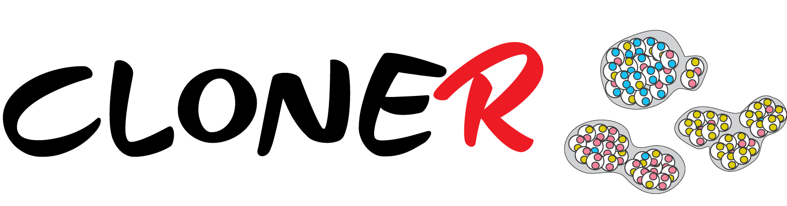

=======

[CloneR] is a **R** application that evaluates the clone composition of a tumour. Starting from molecular data (i.e. results od whole exome/genome sequences and/or genome-wide SNP arrays) and sample specific information (i.e. gender, tumour purity), it estimates:
- the allele frequency of somatic alterations (i.e. point mutations and Copy Number Variant (CNV) regions) correcting for tumour purity and CN status;
- the alteration clonality of each somatic alteration;
- the clone compostion of the tumour (i.e. Monoclonal, Biclonal and Polyclonal)
For each sample, CloneR estimetes the density distribution of the alterations clonalities. If specifed, CloneR produces an heatmap of the alteration clonality of a list of selected genes. 

CloneR is implemented as a R **Shiny** application with interactive plots generated using [Plotly](https://plot.ly)

## Usage
The easiest way to run CloneR is to install **Shiny** package (and the required dependencies) in R, and use the function `runGithub()`. See the example below,
```
install.packages("shiny")
install.packages("shinyjs")
install.packages("shinythemes")
install.packages("DT")
install.packages("plotly")

library(shiny)
library(shinyjs)
library(plotly)
library(shinythemes)
library(DT)

runGitHub("CloneR","ndesai1")
```

## GUI
CloneR can be run on an R shell following the commands reported in the script GUI/CloneR.R

## Input files

- Sample file (tab separated). Columns: sample, gender (man=T, female=F), tumor content (i.e. 0.7)

- Mutation file (tab separated). Columns: sample, chr, position , reference, variant , allele frequency, gene symbol, mutation type (i.e. SNV, InDel)

- CNV file (tab separated). Columns: sample, chr, start , end, cnv type, CN_major, CN_minor, CN_total, CN raw

## Annotation files

In addition to the input files, CloneR needs two more files to run: 

- Gene co-ordinates file (tab separated). Columns: chr, start, end, gene symbol. Can use Genelists/Agilent_genes.tsv or provide your own

- Genes of interest file (tab separated). Columns: gene symbol, gene property (i.e. CGC or actionable). Can use Genelists/NCG5_518_CGC.tsv or provide your own. 

## Contributors

CloneR has been designed by Dr **Matteo Cereda** and Prof **Francesca Ciccarelli**. 

Main developer: Matteo Cereda. 

Contributions are always welcome!

## License

Please read the [Licence](LICENSE) first
